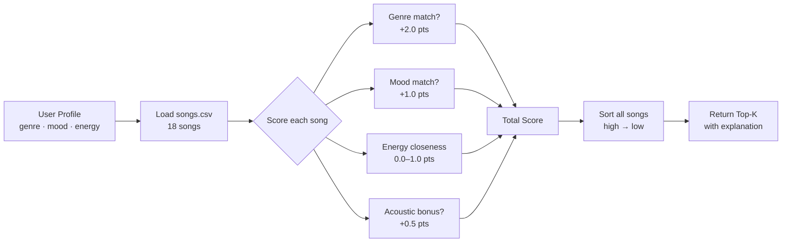

# 🎵 Music Recommender Simulation

## Project Summary

This project simulates a content-based music recommender system. Given a user's taste profile (preferred genre, mood, and energy level), the system scores each song in a small catalog and returns the top matches with a plain-language explanation of why each song was recommended.

Unlike collaborative filtering systems (like Spotify's "users like you also liked..."), this recommender relies only on song attributes — no listening history or crowd behavior is used. This makes it simple, transparent, and easy to reason about, but also limited in ways that are worth examining.

---

## How The System Works

Real-world recommenders like Spotify or TikTok typically combine two approaches: **collaborative filtering** (finding users with similar listening habits and borrowing their preferences) and **content-based filtering** (matching songs to a user based on the song's own features like tempo, mood, or genre). This simulation focuses on content-based filtering so the logic stays visible and easy to reason about.

**Song features used:**
- `genre` - the primary categorical label (pop, lofi, rock, etc.)
- `mood` - the emotional quality (happy, chill, intense, etc.)
- `energy` - a 0–1 float representing how energetic the track feels
- `valence` - a 0–1 float for positivity/brightness
- `danceability` - a 0–1 float for how suited the track is to dancing

**UserProfile stores:**
- `favorite_genre` - the genre the user prefers
- `favorite_mood` - the mood they want
- `target_energy` - the energy level they're looking for (0–1)
- `likes_acoustic` - whether they prefer acoustic-sounding tracks

**Scoring Rule (per song):**
Each song receives points based on how well it matches the user:
- +2 points if genre matches
- +1 point if mood matches
- Up to +1 point for energy closeness: `1 - |song.energy - user.target_energy|`
- Small bonus/penalty based on acousticness if user likes/dislikes acoustic

**Ranking Rule:**
All songs are scored, then sorted highest-to-lowest. The top-k songs are returned with an explanation of why each one was chosen.

**Algorithm Recipe (finalized weights):**
| Feature | Match Type | Points |
|---|---|---|
| Genre | Exact match | +2.0 |
| Mood | Exact match | +1.0 |
| Energy | Closeness: `1 - abs(song.energy - target)` | 0.0–1.0 |
| Acousticness | +0.5 if user likes acoustic and song > 0.6 | +0.5 (bonus) |

Max possible score: ~4.5. Genre is weighted heaviest because it's the broadest filter — a jazz fan and a metal fan have fundamentally different tastes even if both want "intense" energy.

**Potential bias note:** This system may over-prioritize genre, causing it to miss great mood or energy matches from unexpected genres. A chill hip-hop track could score lower than an intense pop track for a "pop" user, even if the user just wants something relaxed.

**Data Flow:**



---

## Getting Started

### Setup

1. Create a virtual environment (optional but recommended):

   ```bash
   python -m venv .venv
   source .venv/bin/activate      # Mac or Linux
   .venv\Scripts\activate         # Windows

2. Install dependencies

```bash
pip install -r requirements.txt
```

3. Run the app:

```bash
python -m src.main
```

### Running Tests

Run the starter tests with:

```bash
pytest
```

You can add more tests in `tests/test_recommender.py`.

---

## Experiments You Tried

Use this section to document the experiments you ran. For example:

- What happened when you changed the weight on genre from 2.0 to 0.5
- What happened when you added tempo or valence to the score
- How did your system behave for different types of users

---

## Limitations and Risks

Summarize some limitations of your recommender.

Examples:

- It only works on a tiny catalog
- It does not understand lyrics or language
- It might over favor one genre or mood

You will go deeper on this in your model card.

---

## Reflection

Read and complete `model_card.md`:

[**Model Card**](model_card.md)

Write 1 to 2 paragraphs here about what you learned:

- about how recommenders turn data into predictions
- about where bias or unfairness could show up in systems like this


---

## 7. `model_card_template.md`

Combines reflection and model card framing from the Module 3 guidance. :contentReference[oaicite:2]{index=2}  

```markdown
# 🎧 Model Card - Music Recommender Simulation

## 1. Model Name

Give your recommender a name, for example:

> VibeFinder 1.0

---

## 2. Intended Use

- What is this system trying to do
- Who is it for

Example:

> This model suggests 3 to 5 songs from a small catalog based on a user's preferred genre, mood, and energy level. It is for classroom exploration only, not for real users.

---

## 3. How It Works (Short Explanation)

Describe your scoring logic in plain language.

- What features of each song does it consider
- What information about the user does it use
- How does it turn those into a number

Try to avoid code in this section, treat it like an explanation to a non programmer.

---

## 4. Data

Describe your dataset.

- How many songs are in `data/songs.csv`
- Did you add or remove any songs
- What kinds of genres or moods are represented
- Whose taste does this data mostly reflect

---

## 5. Strengths

Where does your recommender work well

You can think about:
- Situations where the top results "felt right"
- Particular user profiles it served well
- Simplicity or transparency benefits

---

## 6. Limitations and Bias

Where does your recommender struggle

Some prompts:
- Does it ignore some genres or moods
- Does it treat all users as if they have the same taste shape
- Is it biased toward high energy or one genre by default
- How could this be unfair if used in a real product

---

## 7. Evaluation

How did you check your system

Examples:
- You tried multiple user profiles and wrote down whether the results matched your expectations
- You compared your simulation to what a real app like Spotify or YouTube tends to recommend
- You wrote tests for your scoring logic

You do not need a numeric metric, but if you used one, explain what it measures.

---

## 8. Future Work

If you had more time, how would you improve this recommender

Examples:

- Add support for multiple users and "group vibe" recommendations
- Balance diversity of songs instead of always picking the closest match
- Use more features, like tempo ranges or lyric themes

---

## 9. Personal Reflection

A few sentences about what you learned:

- What surprised you about how your system behaved
- How did building this change how you think about real music recommenders
- Where do you think human judgment still matters, even if the model seems "smart"

