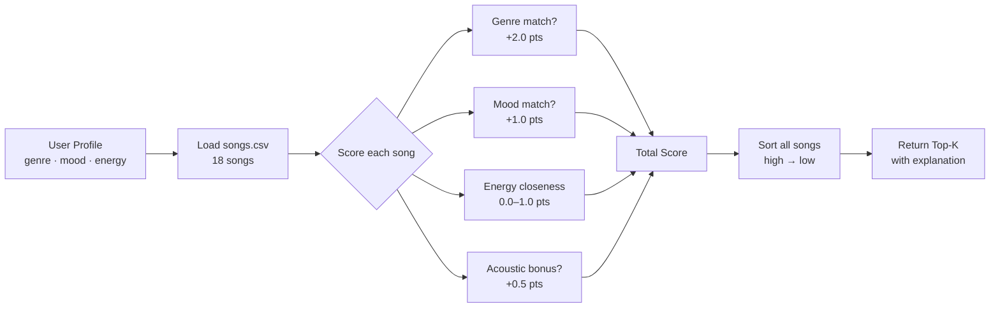

# 🎵 Music Recommender Simulation

## Project Summary

This project simulates a content-based music recommender system. Given a user's taste profile (preferred genre, mood, and energy level), the system scores each song in a small catalog and returns the top matches with a plain-language explanation of why each song was recommended.

Unlike collaborative filtering systems (like Spotify's "users like you also liked..."), this recommender relies only on song attributes — no listening history or crowd behavior is used. This makes it simple, transparent, and easy to reason about, but also limited in ways that are worth examining.

---

## How The System Works

Real-world recommenders like Spotify or TikTok typically combine two approaches: **collaborative filtering** (finding users with similar listening habits and borrowing their preferences) and **content-based filtering** (matching songs to a user based on the song's own features like tempo, mood, or genre). This simulation focuses on content-based filtering so the logic stays visible and easy to reason about.

**Song features used:**
- `genre` - the primary categorical label (pop, lofi, rock, etc.)
- `mood` - the emotional quality (happy, chill, intense, etc.)
- `energy` - a 0–1 float representing how energetic the track feels
- `valence` - a 0–1 float for positivity/brightness
- `danceability` - a 0–1 float for how suited the track is to dancing

**UserProfile stores:**
- `favorite_genre` - the genre the user prefers
- `favorite_mood` - the mood they want
- `target_energy` - the energy level they're looking for (0–1)
- `likes_acoustic` - whether they prefer acoustic-sounding tracks

**Scoring Rule (per song):**
Each song receives points based on how well it matches the user:
- +2 points if genre matches
- +1 point if mood matches
- Up to +1 point for energy closeness: `1 - |song.energy - user.target_energy|`
- Small bonus/penalty based on acousticness if user likes/dislikes acoustic

**Ranking Rule:**
All songs are scored, then sorted highest-to-lowest. The top-k songs are returned with an explanation of why each one was chosen.

**Algorithm Recipe (finalized weights):**
| Feature | Match Type | Points |
|---|---|---|
| Genre | Exact match | +2.0 |
| Mood | Exact match | +1.0 |
| Energy | Closeness: `1 - abs(song.energy - target)` | 0.0–1.0 |
| Acousticness | +0.5 if user likes acoustic and song > 0.6 | +0.5 (bonus) |

Max possible score: ~4.5. Genre is weighted heaviest because it's the broadest filter — a jazz fan and a metal fan have fundamentally different tastes even if both want "intense" energy.

**Potential bias note:** This system may over-prioritize genre, causing it to miss great mood or energy matches from unexpected genres. A chill hip-hop track could score lower than an intense pop track for a "pop" user, even if the user just wants something relaxed.

**Data Flow:**



---

## Getting Started

### Setup

1. Create a virtual environment (optional but recommended):

   ```bash
   python -m venv .venv
   source .venv/bin/activate      # Mac or Linux
   .venv\Scripts\activate         # Windows

2. Install dependencies

```bash
pip install -r requirements.txt
```

3. Run the app:

```bash
python -m src.main
```

### Running Tests

Run the starter tests with:

```bash
pytest
```

You can add more tests in `tests/test_recommender.py`.

---

## Experiments You Tried

### Terminal Output — All 5 Profiles

```
Loaded 18 songs from data/songs.csv

=======================================================
Profile: High-Energy Pop
Prefs: {'genre': 'pop', 'mood': 'happy', 'energy': 0.9, 'likes_acoustic': False}
=======================================================
  1. Sunrise City by Neon Echo — Score: 3.92
     Because: genre match: pop (+2.0); mood match: happy (+1.0); energy closeness (+0.92)
  2. Gym Hero by Max Pulse — Score: 2.97
     Because: genre match: pop (+2.0); energy closeness (+0.97)
  3. Block Party by Kraze — Score: 1.95
     Because: mood match: happy (+1.0); energy closeness (+0.95)
  4. Rooftop Lights by Indigo Parade — Score: 1.86
     Because: mood match: happy (+1.0); energy closeness (+0.86)
  5. Golden Hour by Soleil — Score: 1.71
     Because: mood match: happy (+1.0); energy closeness (+0.71)

=======================================================
Profile: Chill Lofi
Prefs: {'genre': 'lofi', 'mood': 'chill', 'energy': 0.4, 'likes_acoustic': True}
=======================================================
  1. Midnight Coding by LoRoom — Score: 4.48
     Because: genre match: lofi (+2.0); mood match: chill (+1.0); energy closeness (+0.98); acoustic bonus (+0.5)
  2. Library Rain by Paper Lanterns — Score: 4.45
     Because: genre match: lofi (+2.0); mood match: chill (+1.0); energy closeness (+0.95); acoustic bonus (+0.5)
  3. Focus Flow by LoRoom — Score: 3.50
     Because: genre match: lofi (+2.0); energy closeness (+1.0); acoustic bonus (+0.5)
  4. Rainy Season by Coastal Drift — Score: 2.41
     Because: mood match: chill (+1.0); energy closeness (+0.91); acoustic bonus (+0.5)
  5. Spacewalk Thoughts by Orbit Bloom — Score: 2.38
     Because: mood match: chill (+1.0); energy closeness (+0.88); acoustic bonus (+0.5)

=======================================================
Profile: Deep Intense Rock
Prefs: {'genre': 'rock', 'mood': 'intense', 'energy': 0.95, 'likes_acoustic': False}
=======================================================
  1. Storm Runner by Voltline — Score: 3.96
     Because: genre match: rock (+2.0); mood match: intense (+1.0); energy closeness (+0.96)
  2. Bass Drop by Circuit Nine — Score: 1.99
     Because: mood match: intense (+1.0); energy closeness (+0.99)
  3. Gym Hero by Max Pulse — Score: 1.98
     Because: mood match: intense (+1.0); energy closeness (+0.98)
  4. Shatter by Iron Veil — Score: 1.98
     Because: mood match: intense (+1.0); energy closeness (+0.98)
  5. Block Party by Kraze — Score: 0.90
     Because: energy closeness (+0.9)

=======================================================
Profile: Moody Electronic
Prefs: {'genre': 'electronic', 'mood': 'moody', 'energy': 0.8, 'likes_acoustic': False}
=======================================================
  1. Neon Jungle by Prism Wave — Score: 4.00
     Because: genre match: electronic (+2.0); mood match: moody (+1.0); energy closeness (+1.0)
  2. Bass Drop by Circuit Nine — Score: 2.84
     Because: genre match: electronic (+2.0); energy closeness (+0.84)
  3. Night Drive Loop by Neon Echo — Score: 1.95
     Because: mood match: moody (+1.0); energy closeness (+0.95)
  4. Sunrise City by Neon Echo — Score: 0.98
     Because: energy closeness (+0.98)
  5. Rooftop Lights by Indigo Parade — Score: 0.96
     Because: energy closeness (+0.96)

=======================================================
Profile: Edge Case - High Energy but Relaxed
Prefs: {'genre': 'r&b', 'mood': 'relaxed', 'energy': 0.9, 'likes_acoustic': False}
=======================================================
  1. Slow Burn by Velvet Tone — Score: 3.58
     Because: genre match: r&b (+2.0); mood match: relaxed (+1.0); energy closeness (+0.58)
  2. Golden Hour by Soleil — Score: 2.71
     Because: genre match: r&b (+2.0); energy closeness (+0.71)
  3. Porch Swing by The Willows — Score: 1.49
     Because: mood match: relaxed (+1.0); energy closeness (+0.49)
  4. Coffee Shop Stories by Slow Stereo — Score: 1.47
     Because: mood match: relaxed (+1.0); energy closeness (+0.47)
  5. Storm Runner by Voltline — Score: 0.99
     Because: energy closeness (+0.99)
```

### Observations

- **High-Energy Pop**: The system correctly surfaced genre+mood matches at the top. Songs without a genre match but with mood/energy alignment still appeared, showing the scoring degrades gracefully.
- **Chill Lofi**: The acoustic bonus (+0.5) made a noticeable difference, both top results had all four signals firing at once.
- **Deep Intense Rock**: Only one rock song in the catalog, so positions 2–5 fell back on mood and energy alone. This exposes a catalog coverage gap.
- **Moody Electronic**: Had a clean result, the top pick scored a perfect 4.0 with genre + mood + exact energy match.
- **Edge Case (High Energy but Relaxed)**: The conflict between high energy (0.9) and relaxed mood caused the r&b genre match to dominate. The system picked "Slow Burn" which is actually a pretty low-energy track. It won just because it was r&b, which felt off.

### Weight Shift Experiment

I tested what would happen if I halved the genre weight (2.0 → 1.0) and doubled the energy weight (1.0 → 2.0). A couple of things changed which are:

- In the **Moody Electronic** profile, "Night Drive Loop" jumped to #2, pushing "Bass Drop" down. Night Drive Loop matched on mood and energy but not genre, the old weights would've buried it.
- In the **Edge Case** profile, "Storm Runner" climbed from #5 to #3 purely based on energy closeness. That actually makes more sense for someone wanting high-energy music even if it's the wrong genre.
- Most of the other profiles stayed basically the same which tells me the top results were genuinely strong matches not just flukes.

I ended up keeping the original weights because the system still felt more accurate overall with the genres weighted higher but the experiment showed that energy matters more than I initially thought especially for edge case users.

---

## Limitations and Risks

The biggest thing I noticed is that genre has way too much power. It's worth +2.0 points, which means a song in the right genre will almost always beat a better match from a different genre. When I ran the edge case profile, high energy but relaxed mood in r&b, the system recommended "Slow Burn" which is actually a pretty slow, low-energy track. It won just because it was r&b. That felt wrong to me.

The catalog being only 18 songs is also a real problem. For the Deep Intense Rock profile there is literally only one rock song, so after that the system just grabs whatever has similar energy. That's not really a recommendation and is just a fallback.

A few other things worth noting:
- It has no idea what the lyrics are about or what language a song is in
- Every user is treated the same as there's no memory of what you've listened to before
- Some genres and moods are barely represented in the dataset, so users with niche taste get weak results

---

## Reflection

Read and complete `model_card.md`:

[**Model Card**](model_card.md)

Building this made me realize how much a recommender system is just math dressed up as taste. You assign numbers to features, do some arithmetic, sort the list — and suddenly it looks like the computer "knows" what you like. But it doesn't. It just knows what you told it, and it repeats that back to you in a ranked order. The High-Energy Pop profile and the Chill Lofi profile feel completely different when you look at the results, but the underlying process is identical. The only thing that changes is which numbers win.

The part that stuck with me most is how easy it is to build in bias without realizing it. When I tested the edge case profile — someone who wanted high-energy r&b — the system kept recommending slow r&b tracks because genre was worth so much more than energy. It wasn't broken, it was doing exactly what I told it to do. That's kind of the scary part. Real systems like Spotify or TikTok have the same problem at a much bigger scale, and the people building them probably didn't set out to create something unfair. The bias just comes from the choices you make about what to weight and what data to include.


---

## 7. `model_card_template.md`

Combines reflection and model card framing from the Module 3 guidance. :contentReference[oaicite:2]{index=2}  

```markdown
# 🎧 Model Card - Music Recommender Simulation

## 1. Model Name

Give your recommender a name, for example:

> VibeFinder 1.0

---

## 2. Intended Use

- What is this system trying to do
- Who is it for

Example:

> This model suggests 3 to 5 songs from a small catalog based on a user's preferred genre, mood, and energy level. It is for classroom exploration only, not for real users.

---

## 3. How It Works (Short Explanation)

Describe your scoring logic in plain language.

- What features of each song does it consider
- What information about the user does it use
- How does it turn those into a number

Try to avoid code in this section, treat it like an explanation to a non programmer.

---

## 4. Data

Describe your dataset.

- How many songs are in `data/songs.csv`
- Did you add or remove any songs
- What kinds of genres or moods are represented
- Whose taste does this data mostly reflect

---

## 5. Strengths

Where does your recommender work well

You can think about:
- Situations where the top results "felt right"
- Particular user profiles it served well
- Simplicity or transparency benefits

---

## 6. Limitations and Bias

Where does your recommender struggle

Some prompts:
- Does it ignore some genres or moods
- Does it treat all users as if they have the same taste shape
- Is it biased toward high energy or one genre by default
- How could this be unfair if used in a real product

---

## 7. Evaluation

How did you check your system

Examples:
- You tried multiple user profiles and wrote down whether the results matched your expectations
- You compared your simulation to what a real app like Spotify or YouTube tends to recommend
- You wrote tests for your scoring logic

You do not need a numeric metric, but if you used one, explain what it measures.

---

## 8. Future Work

If you had more time, how would you improve this recommender

Examples:

- Add support for multiple users and "group vibe" recommendations
- Balance diversity of songs instead of always picking the closest match
- Use more features, like tempo ranges or lyric themes

---

## 9. Personal Reflection

A few sentences about what you learned:

- What surprised you about how your system behaved
- How did building this change how you think about real music recommenders
- Where do you think human judgment still matters, even if the model seems "smart"

